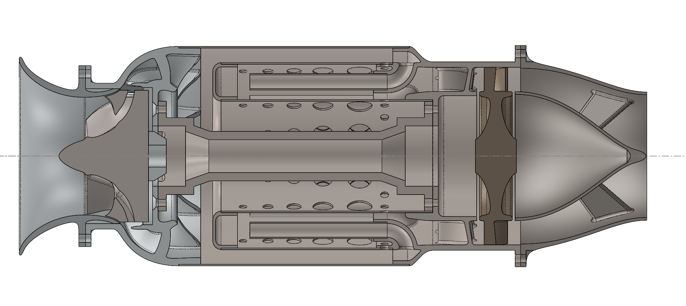

# Jet design



## Optimization

Optimization was completed using the genetic algorithm optimizer in MATLAB. The main uncertainty I have here is the exact formulation of the optimization problem. The complete .mlx script is shown at the end of this section and the .mlx file is in the root folder of this repo.

### Objective formulation

The optimizer takes in a 6 dimensional array of design parameters and then outputs an objective value; in this case it was fuel consumption, which was minimized subject to certain constraints.

The 6 parameters, represented with SI base units, and their optimization bounds were:
- ```omega``` - shaft speed, $[4000,20000]$
- ```R_0``` - inlet radius, $[0.01,0.03]$
- ```R_c``` - compressor outlet radius, $[0.01,0.03]$
- ```A_T``` - turbine area, $[0.0001,0.005]$
- ```R_T``` - turbine mean radius, $[0.1,0.3]$
- ```u_i``` - inlet velocity, $[40,200]$


```m
global C_p u_0 T_t0 P_t0 rho_t0 R h_ker eta_c eta_T gam P_0
%warning('off', 'MATLAB:fzero:InvalidFunctionValue'); % Suppress specific warning

%Constants

R = 287.05;
h_ker = 4.3e7;
eta_c = 0.75;
eta_T = 0.75;
gam = 1.4;
C_p = 1005; %J/(kg*K)


%Inlet conditions
%Stationary at 0m/s at sea level, 15C

u_0 = 0;
T_t0 = 288;
P_t0 = 101570;
P_0 = 101325;
rho_t0 = P_t0/(R*T_t0);

function u_a = compute_u_a(m_dot, rho_t4, T_t4, u_th, C_p, gam, A_T)
    u_a_gen = @(sol) m_dot - rho_t4*(T_t4/(T_t4-((sol^2+u_th^2)/(2*C_p))))^(1/(1-gam))*sol*A_T;
    fzopts = optimset('Display','off');
    u_a = fzero(u_a_gen, (m_dot/(rho_t4*A_T)),fzopts);
end

function [a_min] = choke_area(P_t,T_t,m_dot)

global gam R;

a_min = ((m_dot*R*T_t)/(P_t*(gam*R*T_t)^0.5))*((1+(gam-1)/2)^((gam-1)/(2*(1-gam))));

end


function [m_dotf] = thrust(x)

global C_p u_0 T_t0 P_t0 rho_t0 R h_ker eta_c eta_T gam P_0

try

    omega = x(1); %Shaft speed
    R_0 = x(2);   %Inlet radius
    R_c = x(3);   %Compressor exit radius
    A_T = x(4);   %Turbine area
    R_T = x(5);   %Turbine radius
    u_i = x(6);   %Inlet velocity


    
    %Inlet
    
    %m_dot = pi*R_0^2*u_0*rho_t0;

    m_dot = P_t0/(R*T_t0)*(T_t0/(T_t0-(u_i^2/(2*C_p))))^(1/(1-gam))*u_i*pi*R_0^2;

    %Compressor
    
    tau_c = 1+((omega^2*R_c^2)/(C_p*T_t0));
    T_t3 = tau_c*T_t0;
    P_t3 = P_t0*(tau_c)^(gam/(gam-1));
    %The following static conditions only apply at the impeller exit
    u_3tan = omega*R_c;
    u_3m = u_i;
    u_3 = (u_3tan^2+u_3m^2)^0.5;
    T_3 = T_t3-(u_3^2/(2*C_p));

    
    %Combustion chamber
    t_max = 1100;
    T_t4 = t_max;
    m_dotf = m_dot*C_p*(t_max-T_3)/h_ker;   
    P_t4 = P_t3;
    %These are commented out because the mach number at the stator exit is
    %gonna be higher anyway
    %min_turbine_area = choke_area(P_t4,T_t4,m_dot)
    %con_min_turbine_area = min_turbine_area - A_T

    %Turbine
    %Adiabatically takes out power required for the compressor

    P_req = (1/(eta_c*eta_T))*m_dot*omega^2*R_c^2;
    u_th = ((2*P_req)/m_dot)^0.5;


    %Nozzle
    %Takes what's left and accelerates it by adiabatic expansion to
    %atmospheric pressure

    T_t6 = T_t4 - u_th^2/(2*C_p);
    P_t6 = P_t4*(T_t6/T_t4)^(gam/(gam-1));
    u_7 = (2*C_p*T_t6*(1-(P_0/P_t6)^((gam-1)/gam)))^0.5;

    F = -m_dot*(u_7-u_0);

    
catch
    m_dotf = 1e6;
end
end

function [c,ceq] = jet_calc(x)

global C_p u_0 T_t0 P_t0 rho_t0 R h_ker eta_c eta_T gam P_0

try

    omega = x(1); %Shaft speed
    R_0 = x(2);   %Inlet radius
    R_c = x(3);   %Compressor exit radius
    A_T = x(4);   %Turbine area
    R_T = x(5);   %Turbine radius
    u_i = x(6);   %Inlet velocity


    con_turbine_width = 0.009 - A_T/(2*pi*R_T);
    con_turbine_width_2 = A_T/(2*pi*R_T^2)-1;
    con_impeller_geom = 1-(R_c/R_0);
    
    %Inlet
    
    %m_dot = pi*R_0^2*u_0*rho_t0;

    m_dot = P_t0/(R*T_t0)*(T_t0/(T_t0-(u_i^2/(2*C_p))))^(1/(1-gam))*u_i*pi*R_0^2;
    beta_ci_deg = atan((omega*R_0)/u_i)*(180/pi)
    con_beta_ci_deg = beta_ci_deg - 70;
    M_i = ((R_0^2*omega^2 + u_i^2)/(gam*R*(T_t0-((u_i^2)/(2*C_p)))))^0.5;
    con_impeller_tip_mach = M_i-0.8;
    

    %Compressor
    
    tau_c = (1+((omega^2*R_c^2*eta_c)/(C_p*T_t0)));
    T_t3 = tau_c*T_t0;
    P_t3 = P_t0*(tau_c)^(gam/(gam-1));
    %The following static conditions only apply at the impeller exit
    u_3tan = omega*R_c;
    u_3m = u_i;
    u_3 = (u_3tan^2+u_3m^2)^0.5;
    T_3 = T_t3-(u_3^2/(2*C_p));
    P_3 = P_t3*(T_3/T_t3)^(gam/(gam-1));
    v_sp3 = R*T_3/P_3;
    A_3 = m_dot*v_sp3/u_3m;
    impeller_exit_height = (A_3/(2*pi*R_c))
    M_3 = ((2/(gam-1))*((2*C_p*T_t3)/(2*C_p*T_t3-u_3^2)-1))^0.5;
    con_compressor_exit_mach = M_3 - 0.8;
    diffuser_vane_angle = atan(u_3m/(omega*R_c))*(180/pi)
    
    %Combustion chamber
    t_max = 1100;
    m_dotf = m_dot*C_p*(t_max-T_3)/h_ker;
    T_t4 = t_max;
    
    P_t4 = P_t3;
    rho_t4 = P_t4/(R*T_t4);
    %These are commented out because the mach number at the stator exit is
    %gonna be higher anyway
    %min_turbine_area = choke_area(P_t4,T_t4,m_dot)
    %con_min_turbine_area = min_turbine_area - A_T
    
    %Turbine
    %Adiabatically takes out power required for the compressor
    
    P_req = (1/(eta_T))*m_dot*omega^2*R_c^2
    u_th = P_req/(m_dot*omega*R_T);
    u_a = compute_u_a(m_dot, rho_t4, T_t4, u_th, C_p, gam, A_T);
    u_stator = (u_th^2+u_a^2)^0.5;
    M_stator_exit = ((2/(gam-1))*((2*C_p*T_t4)/(2*C_p*T_t4-u_stator^2)-1))^0.5;
    con_stator_mach = M_stator_exit-0.7;
    beta_s = atan(u_th/u_a);
    beta_s_deg = beta_s*(180/pi);
    con_beta_s_deg = abs(beta_s_deg)-70;
    beta_Ti = atan((u_th-omega*R_T)/u_a);
    beta_Ti_deg = beta_Ti*(180/pi);
    con_beta_Ti_deg = abs(beta_Ti_deg)-65;
    T_t_to = T_t4 - P_req/(m_dot*C_p);
    P_t_to = P_t4*(T_t_to/T_t4)^(gam/(1-gam));
    rho_t_to = P_t_to/(R*T_t_to);
    u_a_to = compute_u_a(m_dot,rho_t_to,T_t_to,0,C_p,gam,A_T);
    beta_to = atan(R_T*omega/u_a_to);
    beta_to_deg = beta_to*(180/pi);
    con_beta_to_deg = abs(beta_to_deg)-65;
    M_to = ((u_a_to^2+omega^2*R_T^2)/(gam*R*(T_t_to-(u_a_to/(2*C_p)))))^0.5;
    con_M_to = M_to-0.8;

    R_Tm = 0.023516;
    R_Td = 0.032338;

    beta_Tim = atan((u_th-omega*R_Tm)/u_a)*(180/pi)
    beta_Tom = atan(R_Tm*omega/u_a_to)*(180/pi)
    beta_Tid = atan((u_th-omega*R_Td)/u_a)*(180/pi)
    beta_Tod = atan(R_Td*omega/u_a_to)*(180/pi)
    %Nozzle
    %Takes what's left and accelerates it by adiabatic expansion to
    %atmospheric pressure
    
    T_t6 = T_t4 - u_th^2/(2*C_p);
    P_t6 = P_t4*(T_t6/T_t4)^(gam/(gam-1));
    u_7 = (2*C_p*T_t6*(1-(P_0/P_t6)^((gam-1)/gam)))^0.5
    M_7 = ((2/(gam-1))*((P_t6/P_0)^((gam-1)/gam)-1))^0.5
    T_7 = (P_t6/P_0)^((gam-1)/gam)*T_t6;
    P_7= P_0;
    A_7 = (m_dot*R*T_7)/(P_7*u_7)*1000
    F = m_dot*(u_7-u_0)
    con_min_thrust = 70 - F;
    tsfc = F/m_dotf
    
    c = [];
    intm = [con_impeller_tip_mach;
        con_stator_mach;
        con_compressor_exit_mach;
        con_beta_to_deg;
        con_beta_Ti_deg;
        con_beta_s_deg;
        con_impeller_geom;
        con_beta_ci_deg;
        con_turbine_width;
        con_turbine_width_2;
        con_min_thrust;
        con_M_to];
    %Sometimes the optimizer loop produces physically impossible solutions
    %These will break the optimizer if they are considered since constraints must be real numbers so these catch blocks are only here to throw out the design by returning a high penalty
    has_invalid = any(isnan(intm) | isinf(intm));
    if has_invalid
        
        c = [];
        ceq = 1e6;
    else
        c = [];
        ceq = max(0,intm);
    end
catch
    c = [];
    ceq = 1e6;
end
end

%This code is set to calculate design parameters for the current optimum
%The line which produces the actual design is the line which runs ga()

%omega R_0 R_c A_T R_T u_i
%f = thrust(x)
%jet_calc(x)
options = optimoptions('ga', 'Display', 'iter');
%options.TolCon = 0.03;
options.PopulationSize = 2000;
intcon = [];
lb = [4000,0.01,0.01,0.0001,0.01,40];
ub = [20000,0.03,0.03,0.005,0.03,200];
%[x,opt]=ga(@thrust,6,[],[],[],[],lb,ub,@jet_calc,intcon,options)


%disp(thrust(x))
%(jet_calc(x))
jet_calc([10183.2,0.0202716,0.0239853,0.00154791,0.0279269,98.3504])
%disp(jet_eval([14189,0.0235,0.0265,0.0017,0.0250,90]))

```