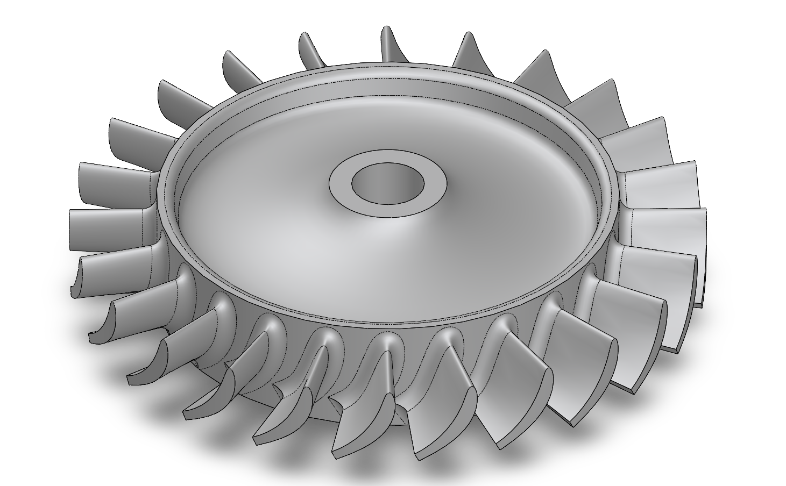
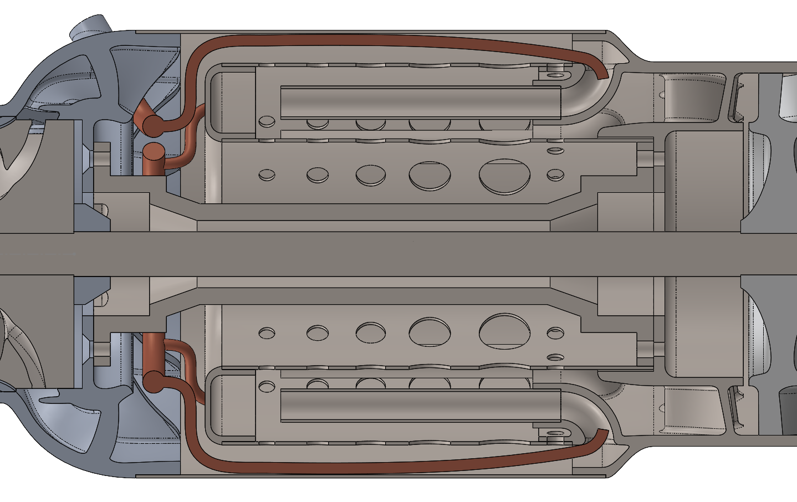

# Jet design

This is an overview of the uncertainties in the design of this engine. The engine is designed to produce 70N of thrust, and has a diameter of 80mm.

The engine uses a single centrifugal impeller and a single stage axial turbine. The combustion chamber has fuel injected through 8 radial ports, where it will evaporate in normal evap tube type injectors and mix with air.

Light grey parts are 6061 Al, and brown parts are 316 steel. The compressor is TiAl6V4 and the turbine is Inconel 719. 


## Optimization

The main question I have here is whether the assumptions made and the way the optimization is formulated make sense, since I don't have much experience with this.

Optimization was completed using the genetic algorithm optimizer in MATLAB. The complete .mlx script is shown at the end of this section and the .mlx file is in the root folder of this repo.

### Objective formulation

The objective here was to minimize fuel consumption for a 70N engine. The choice of 70N was more or less arbitrary and was based on the performance of similar existing jet engines.

The optimizer takes in a 6 dimensional array ```x``` of design parameters and then outputs an objective value. In addition, several design parameters are output which define turbomachinery geometry.

The main function is ```jet_calc(x)```, which calculates a bunch of design parameters and constraints. The other functions are just for the optimizer loop.

The 6 parameters, represented with SI base units, and their optimization bounds were:
- ```omega``` - shaft speed, $[4000,20000]$
- ```R_0``` - inlet radius, $[0.01,0.03]$
- ```R_c``` - compressor outlet radius, $[0.01,0.03]$
- ```A_T``` - turbine area, $[0.0001,0.005]$
- ```R_T``` - turbine mean radius, $[0.1,0.3]$
- ```u_i``` - inlet velocity, $[40,200]$

The final optimum was:
- ```omega``` - 10183.2 $rad/s$
- ```R_0``` - 0.02027 $m$
- ```R_c``` - 0.02399 $m$
- ```A_T``` - 0.001548 $m^2$
- ```R_T``` - 0.02793 $m$
- ```u_i``` - 127.5 $m/s$

Resulting in a fuel consumption of 3.6 grams per second, and a specific impulse / effective exhaust velocity of 19757 m/s.

The assumptions I made which I'm not sure of are listed:

- 75% efficiency in turbine and compressor, both are adiabatic
- $\gamma$ constant as 1.4 even in combustor with $T_t = 1100K$
- Air at standard sea level conditions is accelerated adiabatically to inlet velocity, compressor blades angled to have 0 incidence at this condition
- Stagnation temperature ratio across compressor calculated with Euler equation assuming no inlet swirl and 0 blade backsweep
- Negligible axial flow at compressor exit, relevant for calculating exit mach
- Compressor exit height calculated to ensure constant meridional velocity, again assuming negligible axial component to velocity
- Diffuser inlet angle calculated as ```atan(u_3m/(omega*R_c))```, so again assuming negligible axial flow
- Combustion occurs at stagnation pressure
- Combustor exit stagnation temp is 1100K (fuel flow is calculated to meet this) - hot parts are made of 316 steel, which should be safe up to 1250K
- Turbine and stator geometry, specifically entering and leaving angles and turbine blade length, are calculated using ```A_T, R_T``` and the condition that power extracted is equal to compressor work factoring in inefficiencies using the formulas in the script (these were what I showed you a few weeks ago).
- Turbine and stator reduce flow enthalpy flux by the same amount of power necessary for the compressor
- Nozzle diameter chosen to let exit pressure be ambient, and thrust calculated assuming adiabatic nozzle and using the difference in inlet and exit velocities

### Constraints
The optimizer checked 11 constraints. These are constraints I thought were reasonable, but again I am not certain of these.

Only three constraints were active in the final design, which are bolded

- **Turbine blade length at least 9mm**
- Turbine width at most equal to meanline radius
- Compressor exit radius greater than inlet radius
- Compressor inlet angle at most 70 degrees
- **Compressor mach calculated at exit at most 0.8** (calculated in stationary frame)
- Stator exit mach at most 0.7
- Stator leaving angle at most 70 degrees
- Turbine inlet angle at most 65 degrees
- Turbine leaving angle at most 65 degrees
- Turbine outlet mach at most 0.8 degrees (calculated in meanline rotating frame)
- **Thrust at least 70N**

### Partial optimizer script

This only shows the function which calculates the jet parameters, the full script in in the root folder. Constraint variables are named starting with ```con_```; the optimizer ensures that thay are below 0.

<details>
<summary>click to expand</summary>

```m
function [c,ceq] = jet_calc(x)

global C_p u_0 T_t0 P_t0 rho_t0 R h_ker eta_c eta_T gam P_0

try

    omega = x(1); %Shaft speed
    R_0 = x(2);   %Inlet radius
    R_c = x(3);   %Compressor exit radius
    A_T = x(4);   %Turbine area
    R_T = x(5);   %Turbine radius
    u_i = x(6);   %Inlet velocity


    con_turbine_width = 0.009 - A_T/(2*pi*R_T);
    con_turbine_width_2 = A_T/(2*pi*R_T^2)-1;
    con_impeller_geom = 1-(R_c/R_0);
    
    %Inlet
    
    %m_dot = pi*R_0^2*u_0*rho_t0;

    m_dot = P_t0/(R*T_t0)*(T_t0/(T_t0-(u_i^2/(2*C_p))))^(1/(1-gam))*u_i*pi*R_0^2;
    beta_ci_deg = atan((omega*R_0)/u_i)*(180/pi);
    con_beta_ci_deg = beta_ci_deg - 70;
    M_i = ((u_i^2)/(gam*R*(T_t0-((u_i^2+(omega*R_c)^2)/(2*C_p)))))^0.5;
    con_impeller_tip_mach = M_i-0.8;
    

    %Compressor
    
    tau_c = (1+((omega^2*R_c^2*eta_c)/(C_p*T_t0)));
    T_t3 = tau_c*T_t0;
    P_t3 = P_t0*(tau_c)^(gam/(gam-1));
    %The following static conditions only apply at the impeller exit
    u_3tan = omega*R_c;
    u_3m = u_i;
    u_3 = (u_3tan^2+u_3m^2)^0.5;
    T_3 = T_t3-(u_3^2/(2*C_p));
    P_3 = P_t3*(T_3/T_t3)^(gam/(gam-1));
    v_sp3 = R*T_3/P_3;
    A_3 = m_dot*v_sp3/u_3m;
    impeller_exit_height = (A_3/(2*pi*R_c))
    M_3 = ((2/(gam-1))*((2*C_p*T_t3)/(2*C_p*T_t3-u_3^2)-1))^0.5;
    con_compressor_exit_mach = M_3 - 0.8;
    diffuser_vane_angle = atan(u_3m/(omega*R_c))*(180/pi)
    
    %Combustion chamber
    t_max = 1100;
    m_dotf = m_dot*C_p*(t_max-T_3)/h_ker
    T_t4 = t_max;
    
    P_t4 = P_t3;
    rho_t4 = P_t4/(R*T_t4);
    %These are commented out because the mach number at the stator exit is
    %gonna be higher anyway
    %min_turbine_area = choke_area(P_t4,T_t4,m_dot)
    %con_min_turbine_area = min_turbine_area - A_T
    
    %Turbine
    %Adiabatically takes out power required for the compressor
    
    P_req = (1/(eta_T))*m_dot*omega^2*R_c^2;
    u_th = P_req/(m_dot*omega*R_T);
    u_a = compute_u_a(m_dot, rho_t4, T_t4, u_th, C_p, gam, A_T);
    u_stator = (u_th^2+u_a^2)^0.5;
    T_stator_exit = T_t4 - u_stator^2/(2*C_p);
    P_stator_exit = P_t4*(T_stator_exit/T_t4)^(gam/(gam-1))
    M_stator_exit = ((2/(gam-1))*((2*C_p*T_t4)/(2*C_p*T_t4-u_stator^2)-1))^0.5;
    con_stator_mach = M_stator_exit-0.7;
    beta_s = atan(u_th/u_a);
    beta_s_deg = beta_s*(180/pi)
    con_beta_s_deg = abs(beta_s_deg)-70;
    beta_Ti = atan((u_th-omega*R_T)/u_a);
    beta_Ti_deg = beta_Ti*(180/pi)
    con_beta_Ti_deg = abs(beta_Ti_deg)-65;
    T_t_to = T_t4 - P_req/(m_dot*C_p);
    P_t_to = P_t4*(T_t_to/T_t4)^(gam/(1-gam));
    rho_t_to = P_t_to/(R*T_t_to);
    u_a_to = compute_u_a(m_dot,rho_t_to,T_t_to,0,C_p,gam,A_T);
    beta_to = atan(R_T*omega/u_a_to);
    beta_to_deg = beta_to*(180/pi)
    con_beta_to_deg = abs(beta_to_deg)-65;
    M_to = ((u_a_to^2+omega^2*R_T^2)/(gam*R*(T_t_to-(u_a_to/(2*C_p)))))^0.5;
    con_M_to = M_to-0.8;
    
    
    R_Tm = R_T - (A_T/(4*pi*R_T))
    R_Td = R_T + (A_T/(4*pi*R_T))

    beta_Tim = atan((u_th-omega*R_Tm)/u_a)*(180/pi)
    beta_Tom = atan(R_Tm*omega/u_a_to)*(180/pi)
    beta_Tid = atan((u_th-omega*R_Td)/u_a)*(180/pi)
    beta_Tod = atan(R_Td*omega/u_a_to)*(180/pi)
    %Nozzle
    %Takes what's left and accelerates it by adiabatic expansion to
    %atmospheric pressure
    
    T_t6 = T_t_to;
    T_6 = T_t6 - u_a_to^2/(2*C_p)
    P_t6 = P_t4*(T_t6/T_t4)^(gam/(gam-1));
    P_6 = P_t6*(T_6/T_t6)^(gam/(gam-1))
    u_7 = (2*C_p*T_t6*(1-(P_0/P_t6)^((gam-1)/gam)))^0.5;
    M_7 = ((2/(gam-1))*((P_t6/P_0)^((gam-1)/gam)-1))^0.5;
    T_7 = (P_0/P_t6)^((gam-1)/gam)*T_t6
    P_7= P_0;
    A_7 = (m_dot*R*T_7)/(P_7*u_7)
    F = m_dot*(u_7-u_0)
    con_min_thrust = 70 - F;
    tsfc = F/m_dotf
    
    c = [];
    intm = [con_impeller_tip_mach;
        con_stator_mach;
        con_compressor_exit_mach;
        con_beta_to_deg;
        con_beta_Ti_deg;
        con_beta_s_deg;
        con_impeller_geom;
        con_beta_ci_deg;
        con_turbine_width;
        con_turbine_width_2;
        con_min_thrust;
        con_M_to]

    has_invalid = any(isnan(intm) | isinf(intm));
    if has_invalid
        
        c = [];
        ceq = 1e6;
    else
        c = [];
        ceq = max(0,intm);
    end
catch
    c = [];
    ceq = 1e6;
end
end
```
</details>

For convenience, here are all the intermediate results of the jet calculation. The numerical subscripts are:

- 3: Compressor exit
- 4: Combustor exit
- 6: Turbine exit
- 7: Nozzle exit

I don't remember why I skipped around with these but I guess it made sense at the time
<details>
<summary>Intermediate results</summary>


</details>

## Turbomachinery design

The turbomachinery here was designed according to the optimizer outputs, which prescribe radii and inlet/leaving angles only.

The turbine and compressor are going to be 3d printed out of metal. The printing shop recommends a minimum wall thickness of 1mm and prints surfaces accurate to 0.1mm.

### Compressor


The compressor will be TiAl6V4. Some concerns:

- I avoided backsweep so I could get the highest pressure rise for a given diameter, but most designs I see have about 10-20 degrees of backsweep, and also some blade rake. Is this fine? I should add that I'm not concerned about off-design conditions
- Will setting the blade inlet angles to have 0 incidence at the design point be sufficient to ensure appropriate inlet velocity?
- The inlet radius compared to the compressor radius is proportionally quite large - is this okay?
- The compressor has 0.3mm of clearance from the duct and a compression ratio of approximately 2 - is this good enough to prevent losses?


### Turbine



The turbine will be printed from Inconel 719. 

- Will setting the inlet angle to be such that the blade has 0 incidence at design RPM be enough to ensure that the design RPM is reached?
- How much clearance should the blade tips have with the wall? The best clearance without machining is 0.3mm - will this be sufficient or will I need to machine a more precise fit? There is a pressure drop of 7.5kPa across the turbine.

### Stator-turbine mean line section


## Bearings

I don't know a lot about bearings so I've included them here. There are two bearings, mounted in each end of the shaft tunnel. Each bearing is a standard 608 bearing and will be mounted against the steps on the inside of the shaft tunnel ends. The main concerns are the materials, and the lubrication/cooling system. I can't really find any information on what material to use, but I chose some ceramic bearings which can be seen at the link below - are they usable here?

https://www.ebay.com/itm/354996682357

I also have a cooling system - air from behind the compressor flows into the shaft tunnel through three tangential holes in the shaft tunnel, and a lubricant line is fed through the fourth remaining hole. The idea is that air and lubricant will flow through the shaft tunnel and through the bearings, since the other end of the shaft tunnel opens into the stator exit which is at a lower pressure. There are equalization holes to allow the pressure in the small space behind the compressor to be equal to the compressor stagnation pressure, and the compressor outer rim will be machined to within 0.1mm of the diffuser housing to prevent excessive leakage. The main uncertainty I have here is whether this will work. I am particularly worried that air will leak from the space behind the compressor and leak into the compressor exit, impacting mass flow or reversing the airflow through the shaft tunnel. Currently the tight clearance around the compressor edge is all that really prevents this. The stagnation pressure is around 1.68 bar, compressor exit pressure is 1.10 bar, and stator exit pressure is 1.30 bar.

I've also noticed that most rc jets mix lubricant into the fuel and then use the same mixture both for the bearings and for combustion - is there any benefit to this besides simplifying plumbing? I'm planning on running a separate pure lubricant line directly to the bearings.





## Combustion chamber

The combustion chamber will be made using 0.5mm thick 316 steel sheet. It is a standard evap tube design - fuel will be injected into the base of the tubes through 1mm copper tubing, hit the wall of the evap tube, vaporize, and flow into the combustion chamber. I'm mostly concerned about the air hole pattern and the evap tube design.

The idea with the air hole pattern was to deliver air directly to each of the 8 evap tube fuel injectors, and to dilute the air with progressively larger diameter holes to ensure that the combustor walls are not exposed to a very high temperature. There is also a ring of 3mm dilution holes around the bottom, with the intention being to protect the stagnation points on the evap tube holders and stators. The hole pattern is mostly done by eye based on existing designs which is why I'm concerned.

The evap tubes are also a little strange - due to the limited area in the combustor, they enter radially and then turn 90 degrees in the axial direction. I'm just worried if there will be any problems with this (stagnation very close to the combustor flame, flow to stators disrupted) since I haven't seen this done which makes me think there might be a reason not to.

I am also worried that the flame might "backfire" and fuel and air might combust in the evap tube, and expose it to nearly-stoichiometric kerosene combustion, melting them. This apparently isn't generally an issue with jets but I don't know what mechanism prevents combustion in the evap tubes in such engines and I'm not sure if it will be avoided in this design.


